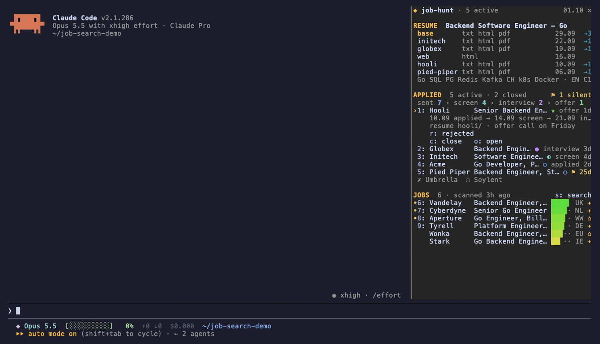

# job-hunt

A job search panel for [Claude Code](https://claude.com/claude-code). It is a mod: a plugin built on Claude Code's function hooks that docks a narrow panel next to the transcript while you work in your job search folder.



The panel keeps the whole search in one place:

- **RESUME**: your resume variants (the base one and a folder per tailored copy), their formats, when each was last edited and how many applications used it.
- **APPLIED**: the funnel `sent › screen › interview › offer`, one row per active application with its stage and age, and a `⚑` flag on anything silent for 21 days.
- **JOBS**: openings Claude found for you, ranked by how well they fit the resume, in two groups: **RELOCATE** (visa sponsorship or relocation) and **REMOTE** (fully remote and workable from your country, whatever the contract form: employee, contractor, B2B or EOR).

Searching and tailoring are Claude turns the panel queues for you, so they use the tools of your own session (web search, scrapers, MCP servers). The mod itself only reads and writes a few JSON files in your folder.

## Requirements

- Claude Code with function hooks (built against 2.1.286). Builds that keep them behind a flag need `CLAUDE_CODE_ENABLE_FUNCTION_HOOKS=1`.
- A folder with `resume.txt`. The mod looks for it in the working directory and up to two parents; without it the panel stays closed and the tools are not registered.

## Install

```sh
git clone https://github.com/vlle/job-hunt-cc.git ~/job-hunt-cc
cd ~/my-job-search          # the folder with resume.txt
CLAUDE_CODE_ENABLE_FUNCTION_HOOKS=1 claude --plugin-dir ~/job-hunt-cc
```

To load it in every session instead, add the folder to `CLAUDE_CODE_PLUGIN_DIRS` in the `env` block of `~/.claude/settings.json`. The panel still opens only where it finds `resume.txt`.

On a terminal at least 144 columns wide the panel docks on the right when the session starts. On a narrower one, `/hunt` opens it.

## Your folder

```
my-job-search/
├── resume.txt            required: marks the folder, and the panel reads your profile from it
├── resume.html, *.pdf    optional formats of the base resume
├── resume-web.html       resume-<name>.txt|html|md in the root is a variant called <name>
├── acme/                 a tailored copy per company: resume.* and a PDF
├── CLAUDE.local.md       optional verified facts beyond the resume (see `facts` below)
└── hunt/
    ├── applications.json written by the mod and its tools
    └── leads.json        written by save_leads
```

From `resume.txt` the panel takes the first three non-empty lines as name, title and contacts (the first contact, split on `·`, `•` or `|`, is your location). It also reads the first three `Key: a, b, c` rows under a `SKILLS` or `TECHNICAL SKILLS` heading and an `English (C1)` style level. A resume in another shape still works; the panel just shows less.

## Using it

| Key | Where | What it does |
| --- | --- | --- |
| `1`–`9` | panel | select a row |
| `j` / `k`, arrows | panel | move the selection (after clicking into the panel) |
| `s` | panel | ask Claude to search for jobs |
| `a` | job | log an application: the job moves to APPLIED |
| `t` | job | ask Claude to tailor the resume for this job |
| `x` | job | hide the job |
| `o` | job or application | open the posting in the browser |
| `n` | application | move to the next stage |
| `r` / `c` | application | mark as rejected / close |
| `p` | panel | swap in made-up demo data for screenshots, and back |

`/hunt` opens the panel. The same actions work by row number: `/hunt scan`, `/hunt anon`, `/hunt apply 3`, `/hunt tailor 3`, `/hunt hide 3`, `/hunt open 3`, `/hunt next 1`, `/hunt reject 1`, `/hunt close 1`.

**Search** (`s`) queues a turn that asks Claude to find up to 10 jobs of each kind matching your target, open every posting to check that it still accepts applications, skip companies you already applied to and save the result with `save_leads`. Jobs found in the last three days get a `•`, a `✈` marks explicit sponsorship, and jobs older than 30 days drop out.

**Tailor** (`t`) queues a turn that creates `<company>/` modelled on your latest tailored folder, using only verified facts, and lists the requirements the resume does not cover. It does not log the application: press `a` when you have sent it.

Claude can also use the tools directly, so you can say "I applied to Acme's backend role" or "Acme invited me to an interview":

| Tool | What it does |
| --- | --- |
| `mcp__job-hunt__save_leads` | merges found jobs into `hunt/leads.json` by url |
| `mcp__job-hunt__log_application` | logs an application; a repeat for the same company and role or url updates it |
| `mcp__job-hunt__set_stage` | moves an application to `screen`, `interview`, `offer`, `rejected` or `closed` |

## Configuration

Set these in `/config` (each is a row there) or under `pluginConfigs` in your settings:

| Option | Default | Used for |
| --- | --- | --- |
| `target` | roles that match the resume: abroad with visa sponsorship or relocation, or fully remote from my country | what the search looks for, one line; say here if you need a particular contract form |
| `exclude` | empty | kinds of jobs the search skips, e.g. `staff/lead roles, frontend, internships` |
| `facts` | `CLAUDE.local.md` | file in your folder with verified facts; search and tailoring may use only these and the resume |

## Data

Everything stays in `hunt/` as plain JSON you can edit by hand. Every write re-reads the file first, and a file that is not valid JSON is never overwritten: the mod refuses and says why. Hidden jobs are stored in `applications.json`, so a new search does not bring them back.

## Development

```sh
claude plugin validate .
CLAUDE_CODE_ENABLE_FUNCTION_HOOKS=1 claude plugin test .
```

For type checking, generate the engine's declarations with `/plugin-types types` in a Claude Code session in this folder, then run `npx -p typescript tsc -p .` (TypeScript 5.6 or later).

- `hooks/register.tsx`: hooks, tools and file I/O
- `hooks/hunt.ts`: pure logic (tracker, jobs, funnel, variants, prompts)
- `hooks/panel.tsx`: the panel, a client module
- `hooks/demo.ts`: the made-up data for `p`

## License

[MIT](LICENSE)
